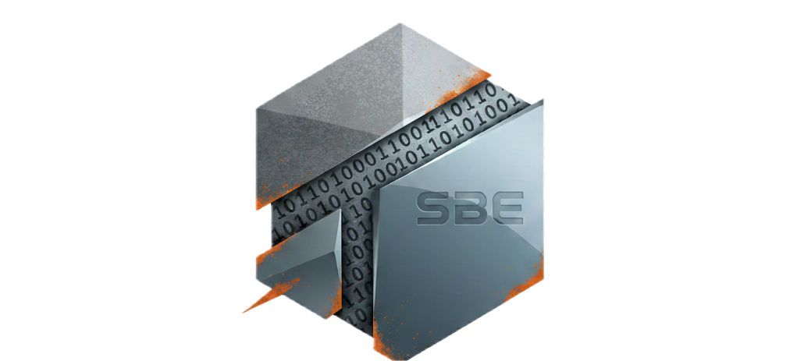
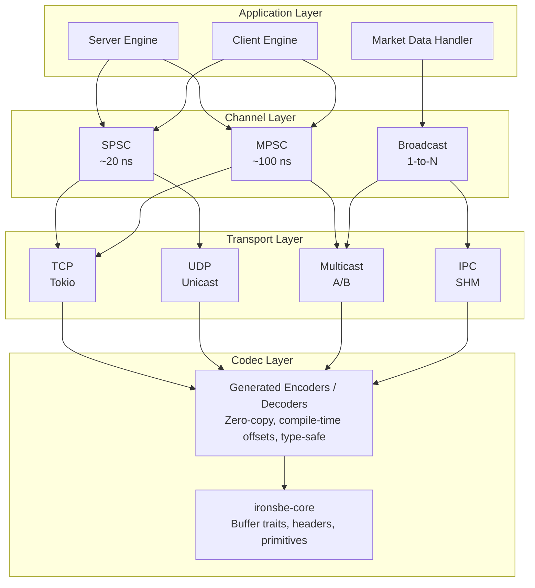

<p align="center">
  
</p>

<h1 align="center">IronSBE</h1>

<p align="center">
  <strong>High-Performance Simple Binary Encoding (SBE) Server/Client for Rust</strong>
</p>

<p align="center">
  <a href="https://crates.io/crates/ironsbe"></a>
  <a href="https://docs.rs/ironsbe"></a>
  <a href="https://github.com/joaquinbejar/IronSBE/actions"></a>
  <a href="https://codecov.io/gh/joaquinbejar/IronSBE"></a>
  <a href="https://github.com/joaquinbejar/IronSBE/blob/main/LICENSE"></a>
</p>

<p align="center">
  Zero-copy • Schema-driven codegen • Sub-microsecond latency • Millions of msg/sec
</p>

---

## Overview

IronSBE is a complete Rust implementation of the [Simple Binary Encoding (SBE)](https://www.fixtrading.org/standards/sbe/) protocol, designed for ultra-low-latency financial systems. It provides both server and client capabilities with a focus on performance, type safety, and ease of use.

SBE is the binary encoding standard used by major exchanges including CME, Eurex, LSE, NASDAQ, and Binance for market data feeds and order entry systems.

### Key Features

- **Zero-copy decoding** - Direct buffer access with compile-time offset calculation
- **Schema-driven code generation** - Type-safe messages from XML specifications
- **Sub-microsecond latency** - Cache-friendly memory layouts with aligned buffers
- **Multi-transport support** - TCP, UDP unicast/multicast, shared memory IPC
- **A/B feed arbitration** - First-arrival-wins deduplication for redundant feeds
- **Market data patterns** - Order book management, gap detection, snapshot recovery
- **100% safe Rust** - No unsafe code in core library
- **Async/await support** - Built on Tokio for high-performance async I/O

---

## Performance

Benchmarked on Apple M4 Max 64GB, macOS Tahoe 26.2:

| Operation | Latency (p50) | Latency (p99) | Throughput |
|-----------|---------------|---------------|------------|
| Encode NewOrderSingle | 3 ns | 4 ns | 342.8M msg/sec |
| Decode NewOrderSingle | 1 ns | 1 ns | 1262.6M msg/sec |
| Encode MarketData (10 entries) | 6 ns | 8 ns | 165.5M msg/sec |
| Decode MarketData (10 entries) | 0 ns | 1 ns | 2178.6M msg/sec |
| SPSC channel send | 2 ns | 2 ns | 648.5M msg/sec |
| MPSC channel send | 7 ns | 9 ns | 145.5M msg/sec |
| TCP round-trip (localhost) | 16.8 μs | 23.7 μs | 60K msg/sec |

Run your own benchmarks:
```bash
cargo run --example benchmark_report --release
```

---

## Quick Start

### Installation

Add IronSBE to your `Cargo.toml`:

```toml
[dependencies]
ironsbe = "0.1"

[build-dependencies]
ironsbe-codegen = "0.1"
```

### Define Your Schema

Create an SBE schema file (`schemas/trading.xml`):

```xml
<?xml version="1.0" encoding="UTF-8"?>
<sbe:messageSchema xmlns:sbe="http://fixprotocol.io/2016/sbe"
                   package="trading"
                   id="1"
                   version="1"
                   byteOrder="littleEndian">
    <types>
        <composite name="messageHeader">
            <type name="blockLength" primitiveType="uint16"/>
            <type name="templateId" primitiveType="uint16"/>
            <type name="schemaId" primitiveType="uint16"/>
            <type name="version" primitiveType="uint16"/>
        </composite>
        
        <enum name="Side" encodingType="uint8">
            <validValue name="Buy">1</validValue>
            <validValue name="Sell">2</validValue>
        </enum>
        
        <type name="Symbol" primitiveType="char" length="8"/>
        <type name="ClOrdId" primitiveType="char" length="20"/>
    </types>
    
    <sbe:message name="NewOrderSingle" id="1" blockLength="48">
        <field name="clOrdId" id="11" type="ClOrdId" offset="0"/>
        <field name="symbol" id="55" type="Symbol" offset="20"/>
        <field name="side" id="54" type="Side" offset="28"/>
        <field name="price" id="44" type="int64" offset="29"/>
        <field name="quantity" id="38" type="uint64" offset="37"/>
    </sbe:message>
</sbe:messageSchema>
```

### Generate Code

Add to your `build.rs`:

```rust
fn main() {
    ironsbe_codegen::generate(
        "schemas/trading.xml",
        &format!("{}/trading.rs", std::env::var("OUT_DIR").unwrap()),
    ).expect("Failed to generate SBE codecs");
}
```

### Encode Messages

```rust
use ironsbe::prelude::*;

// Include generated code
mod trading {
    include!(concat!(env!("OUT_DIR"), "/trading.rs"));
}

use trading::{NewOrderSingleEncoder, Side};

fn main() {
    // Allocate buffer (stack or pool)
    let mut buffer = [0u8; 256];
    
    // Create encoder (writes header automatically)
    let mut encoder = NewOrderSingleEncoder::wrap(&mut buffer, 0);
    
    // Set fields with builder pattern
    encoder
        .set_cl_ord_id(b"ORDER-001           ")
        .set_symbol(b"AAPL    ")
        .set_side(Side::Buy)
        .set_price(15050)      // $150.50 as fixed-point
        .set_quantity(100);
    
    // Get encoded length
    let len = encoder.encoded_length();
    
    // Send buffer[..len] over network
    println!("Encoded {} bytes", len);
}
```

### Decode Messages

```rust
use ironsbe::prelude::*;

mod trading {
    include!(concat!(env!("OUT_DIR"), "/trading.rs"));
}

use trading::{NewOrderSingleDecoder, SCHEMA_VERSION};

fn main() {
    // Received from network
    let buffer: &[u8] = /* ... */;
    
    // Zero-copy decode (no allocation)
    let decoder = NewOrderSingleDecoder::wrap(
        buffer,
        MessageHeader::ENCODED_LENGTH,
        SCHEMA_VERSION,
    );
    
    // Access fields directly from buffer
    println!("ClOrdId: {:?}", decoder.cl_ord_id());
    println!("Symbol: {:?}", decoder.symbol());
    println!("Side: {:?}", decoder.side());
    println!("Price: {}", decoder.price());
    println!("Quantity: {}", decoder.quantity());
}
```

---

## Architecture



---

## Crate Structure

IronSBE is organized as a Cargo workspace with 11 crates:

| Crate | Description |
|-------|-------------|
| [`ironsbe`](ironsbe/) | Facade crate re-exporting public API |
| [`ironsbe-core`](ironsbe-core/) | Buffer traits, message headers, primitive types, encoder/decoder traits |
| [`ironsbe-schema`](ironsbe-schema/) | SBE XML schema parser and validation |
| [`ironsbe-codegen`](ironsbe-codegen/) | Build-time Rust code generation from SBE schemas |
| [`ironsbe-derive`](ironsbe-derive/) | Procedural macros (`#[derive(SbeMessage)]`) |
| [`ironsbe-channel`](ironsbe-channel/) | Lock-free SPSC/MPSC/Broadcast channels |
| [`ironsbe-transport`](ironsbe-transport/) | TCP, UDP unicast/multicast, shared memory IPC |
| [`ironsbe-server`](ironsbe-server/) | Async server engine with session management |
| [`ironsbe-client`](ironsbe-client/) | Async client with auto-reconnection |
| [`ironsbe-marketdata`](ironsbe-marketdata/) | Order book, gap detection, A/B feed arbitration |
| [`ironsbe-bench`](ironsbe-bench/) | Benchmarks using Criterion |

### Dependency Graph

```
ironsbe (facade)
├── ironsbe-core
├── ironsbe-schema
├── ironsbe-codegen
├── ironsbe-channel
├── ironsbe-transport
├── ironsbe-server
├── ironsbe-client
└── ironsbe-marketdata

ironsbe-server
├── ironsbe-core
├── ironsbe-channel
└── ironsbe-transport

ironsbe-client
├── ironsbe-core
├── ironsbe-channel
└── ironsbe-transport

ironsbe-codegen
├── ironsbe-core
└── ironsbe-schema
```

---

## Examples

### Running the Examples

IronSBE includes working server and client examples:

```bash
# Terminal 1: Start the server
cd ironsbe && cargo run --example server

# Terminal 2: Run the client
cd ironsbe && cargo run --example client
```

**Expected output:**

Server:
```
Starting IronSBE server on 127.0.0.1:9000
[Server] Session 1 connected
[Server] Message #1 from session 1: template_id=101, size=45 bytes
[Server] Message #2 from session 1: template_id=102, size=45 bytes
...
[Server] Session 1 disconnected
```

Client:
```
Connecting to IronSBE server at 127.0.0.1:9000
[Client] Connected to server
[Client] Sent message #1
[Client] Received response: 45 bytes
[Client] Response payload: Hello from IronSBE client! Message #1
...
Client stopped
```

### TCP Echo Server

```rust
use ironsbe_core::header::MessageHeader;
use ironsbe_server::builder::ServerBuilder;
use ironsbe_server::handler::{MessageHandler, Responder};
use std::net::SocketAddr;
use std::sync::atomic::{AtomicU64, Ordering};

struct EchoHandler {
    message_count: AtomicU64,
}

impl MessageHandler for EchoHandler {
    fn on_message(
        &self,
        session_id: u64,
        header: &MessageHeader,
        buffer: &[u8],
        responder: &dyn Responder,
    ) {
        let count = self.message_count.fetch_add(1, Ordering::Relaxed) + 1;
        println!(
            "Message #{} from session {}: template_id={}, size={} bytes",
            count, session_id, header.template_id, buffer.len()
        );
        
        // Echo the message back
        responder.send(buffer).ok();
    }

    fn on_session_start(&self, session_id: u64) {
        println!("Session {} connected", session_id);
    }

    fn on_session_end(&self, session_id: u64) {
        println!("Session {} disconnected", session_id);
    }
}

#[tokio::main]
async fn main() -> Result<(), Box<dyn std::error::Error>> {
    let addr: SocketAddr = "127.0.0.1:9000".parse()?;
    let handler = EchoHandler { message_count: AtomicU64::new(0) };

    let (mut server, handle) = ServerBuilder::new()
        .bind(addr)
        .handler(handler)
        .max_connections(100)
        .build();

    // Handle Ctrl+C for graceful shutdown
    let shutdown_handle = std::sync::Arc::new(handle);
    let sh = shutdown_handle.clone();
    tokio::spawn(async move {
        tokio::signal::ctrl_c().await.ok();
        sh.shutdown();
    });

    server.run().await?;
    Ok(())
}
```

### TCP Client

```rust
use ironsbe_client::builder::{ClientBuilder, ClientEvent};
use ironsbe_core::buffer::{AlignedBuffer, ReadBuffer, WriteBuffer};
use ironsbe_core::header::MessageHeader;
use std::net::SocketAddr;
use std::time::Duration;

fn create_message(template_id: u16, payload: &[u8]) -> Vec<u8> {
    let mut buffer = AlignedBuffer::<256>::new();
    let header = MessageHeader::new(payload.len() as u16, template_id, 1, 1);
    header.encode(&mut buffer, 0);
    
    let header_size = MessageHeader::ENCODED_LENGTH;
    buffer.as_mut_slice()[header_size..header_size + payload.len()]
        .copy_from_slice(payload);
    
    buffer.as_slice()[..header_size + payload.len()].to_vec()
}

#[tokio::main]
async fn main() -> Result<(), Box<dyn std::error::Error>> {
    let addr: SocketAddr = "127.0.0.1:9000".parse()?;

    let (mut client, mut handle) = ClientBuilder::new(addr)
        .connect_timeout(Duration::from_secs(5))
        .max_reconnect_attempts(3)
        .build();

    // Run client in background
    tokio::spawn(async move { client.run().await });
    tokio::time::sleep(Duration::from_millis(100)).await;

    // Send messages
    for i in 1..=5 {
        let payload = format!("Hello from client! Message #{}", i);
        let message = create_message(100 + i as u16, payload.as_bytes());
        handle.send(message)?;
        
        // Poll for responses
        while let Some(event) = handle.poll() {
            match event {
                ClientEvent::Message(data) => {
                    println!("Received: {} bytes", data.len());
                }
                ClientEvent::Connected => println!("Connected"),
                ClientEvent::Disconnected => println!("Disconnected"),
                ClientEvent::Error(e) => eprintln!("Error: {}", e),
            }
        }
        
        tokio::time::sleep(Duration::from_millis(100)).await;
    }

    handle.disconnect();
    Ok(())
}
```

### SPSC Channel (Ultra-Low Latency)

```rust
use ironsbe_channel::spsc;

fn main() {
    // Create a lock-free SPSC channel
    let (mut tx, mut rx) = spsc::channel::<u64>(4096);
    
    // Producer thread
    std::thread::spawn(move || {
        for i in 0..1_000_000 {
            // ~12ns send latency
            while tx.send(i).is_err() {
                std::hint::spin_loop();
            }
        }
    });
    
    // Consumer thread - busy-poll for lowest latency
    let mut count = 0u64;
    loop {
        if let Some(value) = rx.recv() {
            count += 1;
            if count >= 1_000_000 {
                break;
            }
        }
    }
    
    println!("Received {} messages", count);
}
```

### Broadcast Channel

```rust
use ironsbe_channel::broadcast::BroadcastChannel;

fn main() {
    let channel = BroadcastChannel::<u64>::new(1024);
    
    // Create multiple subscribers
    let mut sub1 = channel.subscribe();
    let mut sub2 = channel.subscribe();
    
    // Publish messages
    channel.send(42);
    channel.send(100);
    
    // All subscribers receive all messages
    assert_eq!(sub1.recv(), Some(42));
    assert_eq!(sub2.recv(), Some(42));
    assert_eq!(sub1.recv(), Some(100));
    assert_eq!(sub2.recv(), Some(100));
}
```

---

## Supported SBE Features

| Feature | Status |
|---------|--------|
| Primitive types (int8-64, uint8-64, float, double, char) | ✅ |
| Fixed-length arrays | ✅ |
| Enums | ✅ |
| Bitsets (sets) | ✅ |
| Composite types | ✅ |
| Repeating groups | ✅ |
| Nested repeating groups | ✅ |
| Variable-length data | ✅ |
| Optional fields (null values) | ✅ |
| Schema versioning | ✅ |
| Little-endian byte order | ✅ |
| Big-endian byte order | ✅ |
| Message header customization | ✅ |
| Constant fields | ✅ |

---

## System Requirements

### Minimum
- Rust 1.75+
- Linux, macOS, or Windows

### Recommended for Production
- Linux kernel 5.10+ (for io_uring support)
- CPU with AVX2 support
- Dedicated CPU cores (isolcpus)
- 10GbE+ network interface
- Kernel bypass capable NIC (optional)

### System Tuning

```bash
# CPU performance mode
echo performance | sudo tee /sys/devices/system/cpu/cpu*/cpufreq/scaling_governor

# Network tuning
sudo sysctl -w net.core.busy_read=50
sudo sysctl -w net.core.busy_poll=50
sudo sysctl -w net.core.rmem_max=16777216

# NIC tuning (disable interrupt coalescing)
sudo ethtool -C eth0 rx-usecs 0 tx-usecs 0
```

---

## Documentation

- [API Reference](https://docs.rs/ironsbe)
- [Architecture Guide](doc/architecture.md)
- [Examples](ironsbe/examples/)

---

## Development

### Prerequisites

- Rust 1.85+ (Edition 2024)
- Cargo

### Building

```bash
git clone https://github.com/joaquinbejar/IronSBE.git
cd IronSBE

# Build all crates
cargo build --workspace

# Run tests
cargo test --workspace

# Run linting
cargo clippy --all-targets --all-features -- -D warnings

# Format code
cargo fmt --all

# Generate documentation
cargo doc --workspace --no-deps --open
```

### Using the Makefile

The project includes a comprehensive Makefile:

```bash
# Format and lint
make fmt
make lint

# Run tests
make test

# Pre-push checks (recommended before committing)
make pre-push

# Run benchmarks
make bench

# Generate documentation
make doc

# Set version across all crates
make version VERSION=0.2.0

# Publish all crates to crates.io (in dependency order)
make publish-all
```

### Running Examples

```bash
# Run the server example
cd ironsbe && cargo run --example server

# Run the client example (in another terminal)
cd ironsbe && cargo run --example client
```

### Code Style

- Follow Rust standard formatting (`cargo fmt`)
- Pass all clippy lints (`cargo clippy -- -D warnings`)
- Add tests for new functionality
- Update documentation for API changes
- All comments and documentation in English

---

## Contributing

Contributions are welcome! Please follow these steps:

1. Fork the repository
2. Create a new branch for your feature or bug fix
3. Make your changes and ensure that the project still builds and all tests pass
4. Run `make pre-push` to verify everything works
5. Commit your changes and push your branch to your forked repository
6. Submit a pull request to the main repository

---

## Contact

If you have any questions, issues, or would like to provide feedback, please feel free to contact the project maintainer:

- **Author**: Joaquín Béjar García
- **Email**: jb@taunais.com
- **Telegram**: [@joaquin_bejar](https://t.me/joaquin_bejar)
- **Repository**: <https://github.com/joaquinbejar/IronSBE>
- **Documentation**: <https://docs.rs/ironsbe>

---

## License

This project is licensed under the MIT License - see the [LICENSE](LICENSE) file for details.
